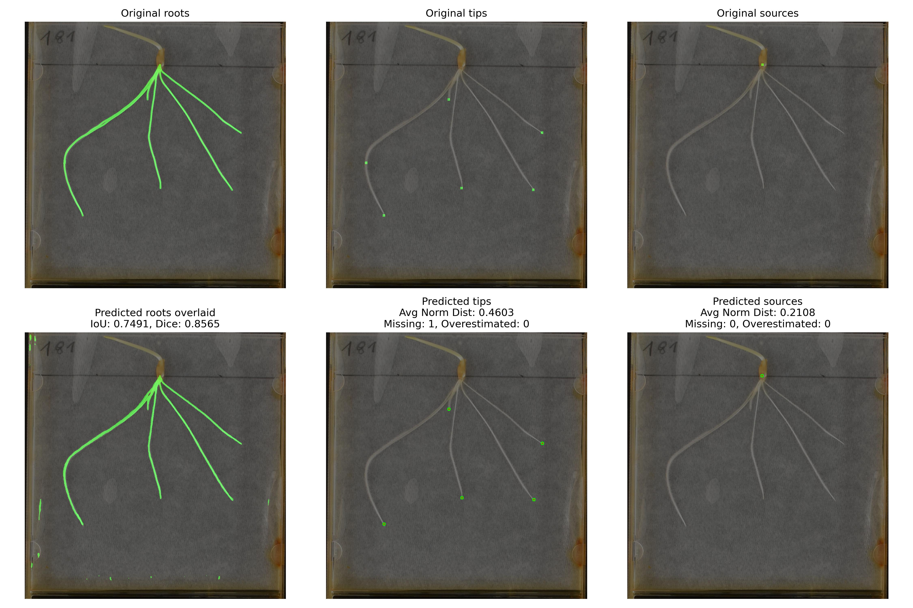

# Rootex 3.0

Approach based on the multi-head method and ResNet, with one Deeplabv3+ classifier for each class (Root, Tip, Source).

# Weight:
Resnet50/101 backbone pth on DeeplabV3\pth

download best model on resnet50 (#6) :
[best_model_Exp_6_Dice_BCE_W_#1_LR_1e-4_ReduceLROnPlateau_2_Weights_0.5_0.5_8_20.pth](https://liveunibo-my.sharepoint.com/:u:/g/personal/maichol_dadi2_unibo_it/Ea_x4_87w_NIiUyBt9PM_JoBD8N7AqMpLG8OuDhCO8SlBQ?e=g300qR)

# Dataset:
[Dataset Training](https://liveunibo-my.sharepoint.com/:u:/g/personal/maichol_dadi2_unibo_it/ESoVKAywhHJHl10rT4j5nyYBaOngIHfMRm3-F345Y3y0KQ?e=hqc0fe)
[Dataset Test Full images](https://drive.google.com/file/d/1Tq8Y2yr_2zMFBKFBP1PzUFvQhBqxz8u3/view?usp=drive_link)
# Training 
### Model Training Configuration

Before starting model training, you can define certain parameters to execute cascade training, which involves training in stages with different parameter configurations to achieve optimal performance. Below are the main configurable parameters:

- **Batch size (train and test)**:  
  The batch size for training and testing. The batch size affects both accuracy and training speed. It's essential to balance these settings, as large batch sizes may require significant memory, while small batch sizes can make learning less stable.

- **Number of epochs**:  
  The total number of epochs for training. An epoch is one complete pass over the entire training dataset. You can increase the number of epochs if the model hasn't yet converged, but it's important to avoid overfitting.

- **Loss function**:  
  The loss (or objective) function used to calculate the model's error compared to the true data. The choice of the loss function depends on the problem type (e.g., segmentation or classification) and can directly impact the quality of the training process.

- **Optimizer**:  
  The optimization algorithm used to update the model's weights during training. Common optimizers include **SGD** (Stochastic Gradient Descent), **Adam**, and others. The choice of optimizer can significantly affect the efficiency and effectiveness of the model's learning.

- **Scheduler**:  
  A method to adapt the learning rate during training. The scheduler dynamically changes the learning rate based on specific conditions, such as the number of epochs or improvements in the loss function, to enhance the model's stability and convergence.

- **Loss weight (per class)**:  
  Weights assigned to each class in the loss function calculation. This is especially useful for handling datasets with strong class imbalances (e.g., imbalances in "tip" and "source" classes in segmentation). Assigning higher weights to underrepresented classes can help improve recognition for those classes.

These parameters are fundamental for configuring a cascade training flow, which may involve stages with different configurations (such as modifying batch size, learning rate, or class weights) to achieve gradual improvements in the model.

# Eval 
Eval metrics extraction -> eval\eval_with_metrics.py
### Model Evaluation Configuration

Below are the parameters required to load and evaluate a trained model on the dataset.

- **model_path**:  
  Path to the trained model file (`.pth`) to load for evaluation.

- **device**:  
  The device to run the model on. Use `'cuda'` for GPU or `'cpu'` for CPU.

- **resize_height** / **resize_width**:  
  Dimensions to resize input images for consistency in model input.

- **root_threshold**:  
  Threshold applied to the model’s root predictions; values above this threshold are classified as positive.

- **tip_threshold**:  
  Threshold for tip predictions.

- **source_threshold**:  
  Threshold for source predictions.

- **sigma**:  
  The predefined size of each tip in the heatmap. Used to determine if a detected tip is considered found or missed, based on the Euclidean distance from the ground truth tip.

- **area_threshold**:  
  Minimum area size for contours; contours larger than this will be split into multiple points if `tips_selected` is `True`.

- **circle_radius**:  
  Radius used to calculate the number of smaller circles needed to split a large contour.

- **spacing_radius**:  
  Spacing between the centers of the smaller circles when a large contour is split.

# Metrics
### Evaluation Metrics

For the root segmentation task, **IoU** (Intersection over Union) and **Dice Score** are used to evaluate the quality of predictions.

For tip and source detection, additional metrics are introduced to assess the model's accuracy in identifying and localizing tips and sources.

### Tip Detection Evaluation

To evaluate the accuracy of tip predictions, we introduce the **Euclidean distance** metric, calculated between each predicted tip and the closest ground truth (GT) tip. Each GT tip has a predefined `sigma` (representing the size of the tip in the heatmap) that the model should locate. We do not require a perfect overlap but only that the predicted tip's center coordinates match the GT tip’s center.

#### Evaluation Process

1. **Distance Calculation**:
   - For each predicted tip, we extract its center and compute the Euclidean distance to the nearest GT tip.
   - If this distance is **greater than `sigma / 4`**, the tip is considered **missed** (missed by the model), and the corresponding GT tip is **overestimated**.

2. **Normalized Distance**:
   - If the predicted tip lies within the area defined by the GT tip’s `sigma`, we calculate the **normalized distance** based on `sigma`:
     - **0** indicates a perfect overlap (the tip centers match exactly).
     - **1** indicates that the predicted tip is located on the edge of the GT tip’s area.

3. **Weighted Distance**:
   - For each **missed** or **overestimated** tip, a weight of **`sigma / 2`** is assigned to the distance.

### Key Metrics

- **tip_mean_distance_found**: Indicates the accuracy of the detected tips, considering only the correctly identified tips.
- **weighted_tips_distance**: Measures the overall quality of predictions, taking into account both detected tips and missed/overestimated tips, with additional weights applied to missed tips.

### Post-Processing

The post-processing is applied to the area covered by the heatmaps for each class. When we detect tips that are very close to each other, a single heatmap often encompasses them. To address this issue, we perform a splitting operation as follows:

#### Key Steps in the Code:

1. **Convert Mask to Binary Format**:
2. **Find Contours**:
3. **Loop Through Each Contour**:
   - For each contour:
     - Calculate the area of the contour.
     - Compute the minimum enclosing circle for the contour to get an approximate center and radius.

4. **Check Area Threshold**:
   - If the area is below a minimum threshold (set to `3` in this code), the contour is ignored.
   - If the area exceeds a predefined `area_threshold` and tips are selected, further splitting is applied.

5. **Calculate the Number of Circles and Spacing**:
   - For large contours, determine the number of smaller circles (`number_of_circles`) needed to split the area, based on a customizable `circle_radius`.
   - Calculate the spacing (`spacing_radius`) between these smaller circles.

6. **Divide the Contour**:
   - Based on the height (`h`) and width (`w`) of the bounding box, either:
     - Generate new centers along the height if the contour is taller than wide, or
     - Generate new centers along the width if the contour is wider than tall.

This post-processing function refines tip localization by splitting large clusters into multiple points, improving the model's accuracy in cases where tips are close together.

# Results 
| Metric                 | Deeplabv3+ (Base) | Deeplabv3+ (PP) | RootTracer-café (Base) | 3head model_#4 (Base) | PP model_#4 | 3head model_#6 (Base) |  PP #6 |
|------------------------|-------------------|---------------------------|-------------------------|---------------------|-----------------------|---------------------------|--------------------------------|
| **iou_mean**           | 0.760            | 0.760                    | 0.570                  | 0.760               | 0.760                 | **0.774**                 | **0.774**                       |
| **dice_mean**          | 86.400           | 86.400                   | 72.000                 | 86.000              | 86.000                | **87.000**                | **87.000**                      |
| **tip_mean_distance_found** | 0.280      | **0.246**                | 1.380                  | 0.256               | 0.270                 | 0.300                     | 0.300                            |
| **source_mean_distance**    | 0.420      | **0.410**                | 1.110                  | 0.480               | 0.480                 | 0.480                     | 0.480                            |
| **missing_tips**       | 25.000           | 21.000                   | 50.000                 | 25.000              | 19.000            | 17.000                    | **16.000**                       |
| **missing_sources**    | 0.000        | 0.000                | 0.000              |0.000           | 0.000             | 0.000                 | 0.000                       |
| **overestimated_tips** | **1.000**        | **1.000**                | 4.000                  | **1.000**           | **1.000**             | 4.000                     | 4.000                            |
| **overestimated_source** | 0.000      | 0.000               | 0.000              | 0.000           | 0.000             | 0.000                | 0.000                       |
| **total_gt_tips**      | 299.00           | 299.00                   | 299.00                 | 299.00              | 299.00                | 299.00                    | 299.00                           |
| **total_gt_sources**   | 54.00            | 54.00                    | 54.00                  | 54.00               | 54.00                 | 54.00                     | 54.00                            |
| **tip % rate**         | 8.70%            | 7.36%                    | 25.42%                 | 7.69%               | 6.69%             | 7.02%                     | **6.35%**                        |
| **source % rate**      | 0.000        | 0.000                | 0.000              | 0.000           | 0.000             | 0.000                 | 0.000                        |
| **weighted_tips_distance** | 0.945      | 0.818                | 2.650                  | 0.870               | 0.800           | 0.830                     | **0.780**                        |
